  <picture>
    <source media="(prefers-color-scheme: dark)" srcset="./assets/header-dark.svg">
    
  </picture>

  

Soy Brayan, estudio Ingeniería de Sistemas en la UNAB, en Bucaramanga, y voy en octavo semestre. Escribo sobre todo backend con Java y Spring Boot, y también trabajo con React, .NET y Kotlin Multiplatform cuando el proyecto lo pide.

De junio de 2023 a septiembre de 2025 estuve en Devs Technology, en una plataforma web con app móvil para gestión de vigilancia que usan equipos de campo en producción. Me tocó la API en Spring Boot (JWT y alertas en tiempo real con WebSocket), los datos en MongoDB, parte de la app en Kotlin Multiplatform y las capacitaciones con el cliente.

Desde agosto de 2026 colaboro con la UNAB como auxiliar de investigación y creación en *Chía: El equilibrio perdido*, un videojuego inspirado en la cultura Muisca que ganó la convocatoria CoCrea 2025. Diseñé la landing page del proyecto, produzco renders de personajes y escenarios y documento las mecánicas de los NPCs.

Este año también hice un cuatrimestre de movilidad en la Universidad Tecnológica de Tula-Tepeji, en México. Para uno de los proyectos diseñé en GNS3 la red de un campus de más de 17 edificios, con VLANs, OSPF, ACLs y autenticación con RADIUS.

## Con qué trabajo

  

- **Backend:** Java, Spring Boot, .NET (C#), ASP.NET Web API, PHP y Python
- **APIs y seguridad:** REST, JWT, WebSocket y control de acceso por roles
- **Frontend:** React, JavaScript, Bootstrap y jQuery
- **Móvil:** Kotlin Multiplatform y Jetpack Compose
- **Bases de datos:** MongoDB, PostgreSQL, SQL Server, Oracle y Firebase
- **Videojuegos:** Unity y C#
- **Infraestructura:** Docker, Git, CI/CD, AWS (cursos de AWS Academy) y redes con GNS3 y Cisco IOS

## Cosas que he construido

**Meditraz.** Prototipo web para el seguimiento de medicamentos con código de barras y alertas de caducidad, hecho con Angular y ASP.NET Core. Lo presentamos como investigación en el encuentro de semilleros de la UNAB en 2022: [código](https://github.com/bleon133/Meditraz) y [artículo](https://repository.unab.edu.co/bitstream/20.500.12749/20899/3/2022_Articulo_Leon_Martinez_Brayan_Steven.pdf).

**InsulinaVR.** Mi proyecto de grado: un prototipo de realidad virtual con Unity y Google Cardboard para enseñar técnicas de insulinización. Sigue en desarrollo.

**HuronTroll y Cthulhu Jamboree.** Dos juegos hechos en equipo durante la Global Game Jam, en 2024 y 2025. Cthulhu Jamboree se puede jugar en el navegador en [itch.io](https://crimpatches.itch.io/chutulu-jamboree). Código: [HuronTroll](https://github.com/bleon133/HuronTroll) y [GameJam2025](https://github.com/bleon133/GameJam2025).

**Mi portafolio.** Hecho con React, TypeScript y Tailwind. Está en [brayandeveloper.online](https://brayandeveloper.online/) y el [código está aquí](https://github.com/bleon133/Portafolio-Brayan-04-10-2026).

El código de la plataforma de vigilancia es de la empresa y no es público. Lo que puedo contar de ese trabajo está en el portafolio.

## Qué busco

Prácticas profesionales en 2027-1, en un rol de backend o full stack, para aportar en desarrollo web, bases de datos y diseño de soluciones, y seguir aprendiendo en proyectos reales. Puedo trabajar en remoto o mudarme de ciudad. Mi inglés es B2 (EF SET, 60/100).

## Actividad

  <picture>
    <source media="(prefers-color-scheme: dark)" srcset="https://raw.githubusercontent.com/bleon133/bleon133/output/github-snake-dark.svg">
    
  </picture>

## Dónde encontrarme

  
  
  

